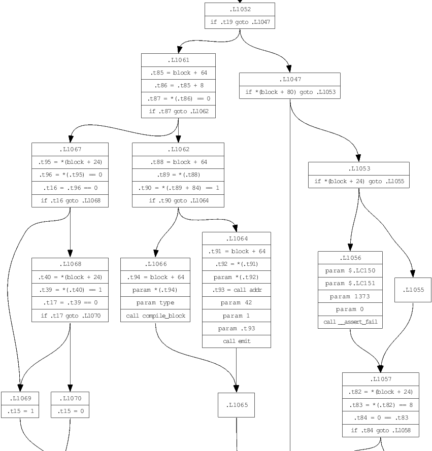
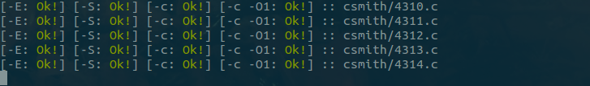

lacc: A simple, self-hosting C compiler
=======================================
This is a toy project of mine, with the goal of making a compiler for C, written in C, which is able to compile itself.

Features
--------
 * Complete support for C89, in addition to some features from later standards.
 * Target x86_64 assembly GNU syntax (-S), binary ELF object files (-c), or pure  preprocessing (-E).
 * Rich intermediate representation, building a control flow graph (CFG) with basic blocks of three-address code for each function definition. This is the target for basic dataflow analysis and optimization.

Install
-------
Clone and build from source, and the binary will be placed in `bin/lacc`.
Default include paths on Linux assume system headers being available at `/usr/include/x86_64-linux-gnu`, configurable by defining `SYSTEM_LIB_PATH`.
BSD libc needs no special handling.

    git clone https://github.com/larmel/lacc.git
    cd lacc
    make

Certain standard library headers, such as `stddef.h` and `stdarg.h`, contain definitions that are inherently compiler specific, and are provided specifically for lacc under [include/stdlib/](include/stdlib).
The compiler is looking for these files at a default include path configurable by defining `LACC_LIB_PATH`, which by default points to the bin directory under the local source tree.
The install target copies the standard headers to `/usr/local/lib/lacc`, and produces an optimized binary with this as the default include path.

    make install

The binary is placed in `/usr/local/bin`, which enables running `lacc` directly from terminal.
Execute `make uninstall` to remove all the files that were copied.

Usage
-----
Command line interface is kept similar to GCC and other compilers, using mostly a subset of the same flags and options.

    -E         Output preprocessed.
    -S         Output GNU style textual x86_64 assembly.
    -c         Output x86_64 ELF object file.
    -dot       Output intermediate representation in dot format.
    -o         Specify output file name. If not speficied, default to input file
               name with suffix changed to '.s', '.o' or '.dot' when compiling
               with -S, -c or -dot, respectively. Otherwise use stdout.
    -std=      Specify C standard, valid options are c89, c99, and c11.
    -I         Add directory to search for included files.
    -w         Disable warnings.
    -g         Generate debug information (DWARF).
    -O{0..3}   Set optimization level.
    -D X[=]    Define macro, optionally with a value. For example -DNDEBUG, or
               -D 'FOO(a)=a*2+1'.
    -f[no-]PIC Generate position-independent code.
    -v         Print verbose diagnostic information. This will dump a lot of
               internal state during compilation, and can be useful for debugging.
    --help     Print help text.

Arguments that do not match any option are taken to be input files.
If no compilation mode is specified, lacc will act as a wrapper for the system linker `/bin/ld`.
Some common linker flags are supported.

    -Wl,       Specify linker options, separated by commas.
    -L         Add linker include directory.
    -l         Add linker library.
    -shared    Passed to linker as is.
    -rdynamic  Pass -export-dynamic to linker.

As an example invocation, here is compiling [test/fact.c](test/fact.c) to object code, and then using the system linker to produce the final executable.

    bin/lacc -c test/fact.c -o fact.o
    bin/lacc fact.o -o fact

The program is part of the test suite, calculating 5! using recursion, and exiting with the answer.
Running `./fact` followed by `echo $?` should print `120`.

Implementation
--------------
The compiler is written in C89, counting around 19k lines of code in total.
There are no external dependencies except for the C standard libary, and some system calls required to invoke the linker.

The implementation is organized into four main parts; preprocessor, parser, optimizer, and backend, each in their own directory under [src/](src/).
In general, each module (a `.c` file typically paired with an `.h` file defining the public interface) depend mostly on headers in their own subtree.
Declarations that are shared on a global level reside in [include/lacc/](include/lacc).
This is where you will find the core data structures, and interfaces between preprocessing, parsing, and code generation.

### Preprocessor
Preprocessing includes reading files, tokenization, macro expansion, and directive handling.
The interface to the preprocessor is `peek(0)`, `peekn(1)`, `consume(1)`, `try_consume(1)`, and `next(0)`, which looks at a stream of preprocessed `struct token` objects.
These are defined in [include/lacc/token.h](include/lacc/token.h).

Input processing is done completely lazily, driven by the parser calling these functions to consume more input.
A buffer of preprocessed tokens is kept for lookahead, and filled on demand when peeking ahead.

### Intermediate Representation
Code is modeled as control flow graph of basic blocks, each holding a sequence of three-address code statements.
Each external variable or function definition is represented by a `struct definition` object, defining a single `struct symbol` and a CFG holding the code.
The data structures backing the intermediate representation can be found in [include/lacc/ir.h](include/lacc/ir.h).

Visualizing the intermediate representation is a separate output target.
If the -dot option is specified, a dot formatted text file is produced as output.

    bin/lacc -dot -I include src/backend/compile.c -o compile.dot
    dot -Tps compile.dot -o compile.ps

Below is an example from a function found in [src/backend/compile.c](src/backend/compile.c), showing a slice of the complete graph.
The full output can be generated as a PostScript file by running the commands shown.

Each basic block in the graph has a list of statements, most commonly `IR_ASSIGN`, which assigns an expression (`struct expression`) to a variable (`struct var`).
Expressions also contain variable operands, which can encode memory locations, addresses and dereferenced pointers at a high level.

 * `DIRECT` operands refer to memory at `*(&symbol + offset)`, where symbol is a variable or temporary at a specific location in memory (for example stack).
 * `ADDRESS` operands represent exactly the address of a `DIRECT` operand, namely `(&symbol + offset)`.
 * `DEREF` operands refer to memory pointed to by a symbol (which must be of pointer type).
 The expression is `*(symbol + offset)`, which requires two load operations to map to assembly. Only `DEREF` and `DIRECT` variables can be target for assignment, or l-value.
 * `IMMEDIATE` operands hold a constant number, or string. Evaluation of immediate operands do constant folding automatically.

### Parser
The parser is hand coded recursive descent, with main parts split into [src/parser/declaration.c](src/parser/declaration.c), [src/parser/initializer.c](src/parser/initializer.c), [src/parser/expression.c](src/parser/expression.c), and [src/parser/statement.c](src/parser/statement.c).
The current function control flow graph, and the current active basic block in that graph, are passed as arguments to each production.
The graph is gradually constructed as new three-address code instructions are added to the current block.

The following example shows the parsing rule for bitwise or expressions, which
adds a new `IR_OP_OR` operation to the current block.
Logic in `eval_expr` will ensure that the operands `value` and `block->expr` are valid, terminating in case of an error.

    static struct block *inclusive_or_expression(
        struct definition *def,
        struct block *block)
    {
        struct var value;

        block = exclusive_or_expression(def, block);
        while (try_consume('|')) {
            value = eval(def, block, block->expr);
            block = exclusive_or_expression(def, block);
            block->expr = eval_or(def, block, value, eval(def, block, block->expr));
        }

        return block;
    }

The latest evaluation result is always stored in `block->expr`.
Branching is done by instantiating new basic blocks  and maintaining pointers.
Each basic block has a true and false branch pointer to other blocks, which is how branches and gotos are modeled.
Note that at no point is there any syntax tree structure being built.
It exists only implicitly in the recursion.

### Optimizer
The main motivation for building a control flow graph is to be able to do dataflow analysis and optimization.
The current capabilities here are still limited, but it can easily be extended with additional and more advanced analysis and optimization passes.

Liveness analysis is used to figure out, at every statement, which symbols may later be read.
The dataflow algorithm is implemented using bit masks for representing symbols, numbering them 1-63.
As a consequence, optimization only works on functions with less than 64 variables.
The algorithm also has to be very conservative, as there is no pointer alias analysis (yet).

Using the liveness information, a transformation pass doing dead store elimination can remove `IR_ASSIGN` nodes which provably do nothing, reducing the size of the generated code.

### Backend
There are three backend targets: textual assembly code, ELF object files, and
dot for the intermediate representation.
Each `struct definition` object yielded from the parser is passed to the [src/backend/compile.c](src/backend/compile.c) module.
Here we do a mapping from intermediate control flow graph representation down to a lower level IR, reducing the code to something that directly represents x86_64 instructions.
The definition for this can be found in [src/backend/x86_64/instr.h](src/backend/x86_64/instr.h).

Depending on function pointers set up on program start, the instructions are
sent to either the ELF backend, or text assembly.
The code to output text assembly is therefore very simple, more or less just a mapping between the low level IR instructions and their GNU syntax assembly code.
See [src/backend/x86_64/assemble.c](src/backend/x86_64/assemble.c).

Dot output is a separate pipeline that does not need low level IR to be generated.
The compile module will simply forward the CFG to [src/backend/graphviz/dot.c](src/backend/graphviz/dot.c).

Correctness
-----------
Testing is done by comparing the runtime output of programs compiled with lacc and the system compiler (cc).
A collection of small standalone programs used for validation can be found under the [test/](test/) directory.
Tests are executed using [check.sh](check.sh), which will validate preprocessing, assembly, and ELF outputs.

    $ ./check.sh bin/lacc test/fact.c
    [-E: Ok!] [-S: Ok!] [-c: Ok!] [-c -O1: Ok!] :: test/fact.c

A complete test of the compiler is done by going through all test cases on a self-hosted version of lacc.

    make test

This will first create a binary produced by cc, giving `bin/lacc`.
Then we use `bin/lacc` to build `bin/bootstrap/lacc`, which in turn is used to build `bin/selfhost/lacc`.
Between the bootstrap and selfhost stages, the intermediate object files are compared for equality.
If everything works correctly, these stages should produce identical binaries.
The compiler is ''good'' when all tests pass on the selfhost binary.
This should always be green, on every commit.

### Csmith
It is hard to come up with a good test suite covering all possible cases.
In order to weed out bugs, we can use [csmith](https://embed.cs.utah.edu/csmith/) to generate random programs that are suitable for validation.

    ./csmith.sh

The [csmith.sh](csmith.sh) script runs csmith to generate an infinite sequence of random programs until something fails the test harness.
It will typically run thousands of tests without failure.

The programs generated by Csmith contain a set of global variables, and functions making mutations on these.
At the end, a checksum of the complete state of all variables is output.
This checksum can then be compared against different compilers to find discreptancies, or bugs. See [doc/random.c](doc/random.c) for an example program generated by Csmith, which is also compiled correctly by lacc.

### Creduce
When a bug is found, we can use [creduce](https://embed.cs.utah.edu/creduce/) to make a minimal repro.
This then will end up as a new test case in the normal test suite.

Performance
-----------
Some effort has been put into making the compiler itself fast (although the generated code is still very much unoptimized).
Serving as both a performance benchmark and correctness test, we use the [sqlite](https://sqlite.org/download.html) database engine.
The source code is distributed as a single ~7 MB (7184634 bytes) large C file spanning more than 200 K lines (including comments and whitespace), which is perfect for stress testing the compiler. 

The following experiments were run on a laptop with an i5-7300U CPU, compiling version 3.20.1 of sqlite3.
Measurements are made from compiling to object code (-c).

### Compilation speed

It takes less than 200 ms to compile the file with lacc, but rather than time we look at a more accurate sampling of CPU cycles and instructions executed.
Hardware performance counter data is collected with `perf stat`, and memory allocations with `valgrind --trace-children=yes`.
In valgrind, we are only counting contributions from the compiler itself (`cc1` executable) while running GCC.

Numbers for lacc is from an optimized build produced by `make CC='clang -O3 -DNDEBUG' bin/lacc`.
Each compiler is invoked with arguments `-c sqlite/sqlite3.c -o foo.o`.

| Compiler       |        Cycles |   Instructions | Allocations | Bytes allocated | Result size |
|:---------------|--------------:|---------------:|------------:|----------------:|------------:|
| lacc           |   469,541,318 |    659,369,509 |      51,458 |      32,756,562 |   1,588,286 |
| tcc (0.9.27)   |   245,142,166 |    397,514,762 |       2,909 |      23,020,917 |   1,409,716 |
| gcc (9.3.0)    | 9,958,514,599 | 14,524,274,665 |   1,546,790 |   1,111,331,606 |   1,098,408 |
| clang (10.0.0) | 4,351,456,211 |  5,466,808,426 |   1,434,072 |     476,529,342 |   1,116,992 |

There is yet work to be done to get closer to [TCC](http://bellard.org/tcc/), which is probably one of the fastest C compilers available.
Still, we are within reasonable distance from TCC performance, and an order of magnitude better than GCC and clang.

### Codegen quality

From the above table, we can see that the size of the sqlite object file generated by lacc is larger than those generated by other compilers, suggesting that we output less optimal code.

To compare the relative quality of code generated from lacc and GCC, we can look at the number of dynamic instructions executed by the selfhost binary versus a binary built by GCC.
We run the same test as above, compiling sqlite to object code.
Targets for the test are the default compiler build (`bin/lacc`) produced by GCC, and the selfhost binary (`bin/selfhost/lacc`) produced by lacc.
Both of these targets are produced without any optimizations enabled, and without defining `NDEBUG`.

| Compiler        | Cycles        | Instructions   |
|:----------------|--------------:|---------------:|
| lacc            | 1,046,327,532 |  1,659,594,278 |
| lacc (selfhost) | 1,545,060,672 |  2,181,702,144 |

The selfhosted binary is slower to compile sqlite than the compiler built by GCC, showing that lacc indeed generates rather inefficient code.
Improving the backend with better instruction selection is a priority, so these numbers should hopefully get closer in the future.

References
----------
These are some useful resources for building a C compiler targeting x86_64.

 * The C Programming Language, Second Edition. Brian W. Kernighan, Dennis M. Ritchie.
 * [System V Application Binary Interface](http://www.x86-64.org/documentation/abi.pdf).
 * [Intel® 64 and IA-32 Architectures Software Developer’s Manuals](http://www.intel.com/content/www/us/en/processors/architectures-software-developer-manuals.html), specifically the instruction set reference.
